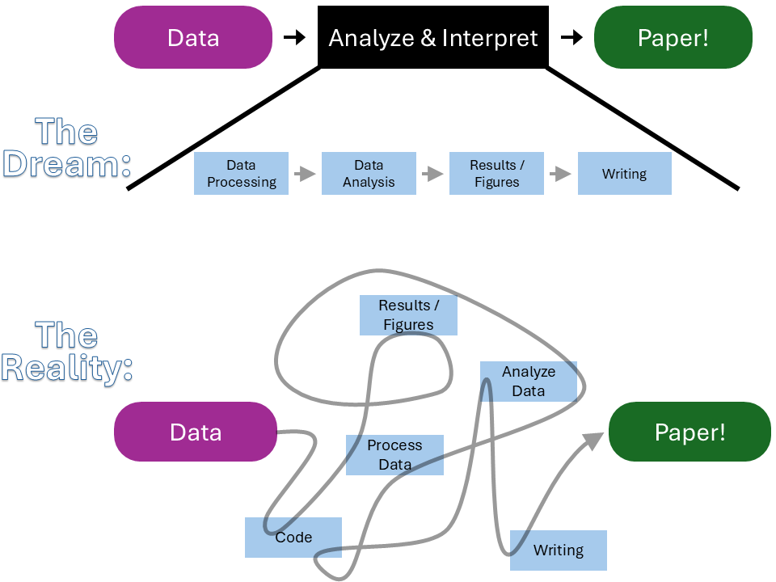

# Learning Goals

- What is reproducibility and why should I care?

- 4 habits for reproducible research\
  *Bonus!:* some activities to refresh your R coding skills

- Git and GitHub make it easy to track changes & collaborate
\
\
\

# What is Reproducibility? 

Here we insert a slide deck explaining what is reproducibility
\
\
\

**Doing Research:**

{width=50%}

That's okay! Having a **Data Management Plan** and good habits helps us get closer to the dream :)
\
\
\

## Doing reproducible research

> **Goal:** being able to re-create the *data and analysis* so that you and others can (ideally) arrive at the *same interpretations* of your results.

So, should we keep everything?

{width=35%}

Nobody wants to deal with this!
\
\
\

# Habits for Reproducible Research

> **Goal:** being able to re-create the *data and analysis* so that you and others can (ideally) arrive at the *same interpretations* of your results.

~~Keep everything!~~

Keep *almost* everything in such a way that you, or people after you, can (happily?) go back to it.

4 reproducibility principles for achieving this are:

<ol> <!-- Force the numbering to be out of order -->
  <li value="1"> **Annotate:** explain what you're doing and why. </li>
  <li value="3"> **Automate:** make your decisions explicit by using code. </li>
  <li value="4"> **Share:** provide access to your work. </li>
  <li value="2"> **Hoard:** ... you will still have to keep *almost* everything ...</li>
</ol>
\
\
\
\
\
\

## 1. Annotate 

**Write explanations for your future collaborators**\
What? How? *Why?!*

**Habits:** use script headers, use meaningful & human-readable names, comment your code

**Tools:** notebook documents (e.g., R Notebook (.Rmd) files in RStudio)

### Time for Action: Annotate!
Here we insert a slide deck with the activity

\
\
\

## 2. Hoard 

**Keep *almost* everything**

**Habits:** backup regularly (daily!), versions of software & packages, store raw data & intermediate steps in data processing, store code & progress on code

**Tools:** backup software (e.g., OneDrive is free for UniBE students),\
version control (e.g., git), online repositories (e.g., GitHub)

### Time for Action: Hoard!

The window below contains a function (`get.multiples1to10`) that multiplies the integers from 1 to 10 (`1:10`) by a constant value (`multiplier`), which is currently set to `3`. So it should print out ten multiples of 3, from 3 to 30.

**Run the code to convince yourself that it's working properly.**

<!-- This block embeds an interactive R console via RDrr  -->
   
  <!-- Reload Button on top right -->
  <button id="reloadGoodCode"
        style="float: right; margin-left: 10px; font-size: 20px; padding: 10px 25px; border-radius: 7px; border: none; background-color: var(--action-contrast); color: var(--action-color);">
  Please reload the original code!
  </button>
  <!-- iframe (this is the R console) -->
  <iframe id="goodCode"
          src="https://rdrr.io/snippets/embed/?code=%23%20simple%20function%20to%20multiply%20integers%20from%201%20to%2010%20by%20parameter%20value%20(%22multiplier%22)%0Aget.multiples1to10%20%3C-%20function(multiplier)%7B%0A%20%20%20numbers%20%3C-%201%3A10%0A%20%20%20return(multiplier%20*%20numbers)%0A%7D%0A%0A%23%20display%20results%20for%20parameter%20value%20set%20to%203%0Acurrent_value%20%3C-%203%0Aresults%20%3C-%20get.multiples1to10(multiplier%20%3D%20current_value)%0Aprint(results)"
          width="100%" height="500" style="margin-top: 10px;" frameborder="0"></iframe>

  <!-- JavaScript -->
  
   

The window below contains a buggy version of the same code.

**Find the bug and fix it so the code runs properly.**

<!-- This block embeds an interactive R console via RDrr  -->
   
  <!-- Reload Button on top right -->
  <button id="reloadBuggyCode"
        style="float: right; margin-left: 10px; font-size: 20px; padding: 10px 25px; border-radius: 7px; border: none; background-color: var(--action-contrast); color: var(--action-color);">
  Please reload the original code!
  </button>

  <!-- iframe placeholder (this is the R console) -->
  <iframe id="buggyCode"
          width="100%" height="500" style="margin-top: 10px;" frameborder="0"></iframe>
  
  <!-- Sample new bug Button below everything -->
  <button id="sampleNewBug"
        style="font-size: 20px; padding: 10px 25px; border-radius: 7px; border: none; background-color: var(--action-contrast); color: var(--action-color);">
  I fixed it :D  Now give me a new bug to fix!
  </button>

  <!-- JavaScript -->
  

\
\
\

## 3. Automate 

**Avoid manual manipulation**\
waste of time & error-prone\
decisions are <u>not</u> explicit and can be inconsistent

**Habits:** find+replace, use a scripting language for your analyses, automatically save parameters in the filename.

**Tools:** notebook documents

Here we insert a slide deck with the activity
\
\
\

## 4. Share 

**Fundamentally, research is about sharing**\
with collaborators, with other scientists

**Habits:** think about your <u>audience</u> when analyzing (see annotate), share early and often

**Tools:** online repositories for data (e.g., Dryad), code (e.g., GitHub), and papers (e.g., EcoEvoRxiv)
\
\
\
\
\
\

## Reproducibility principles

  - **Annotate:** explain what you're doing and why.
  - **Automate:** make your decisions explicit by using code.
  - **Share:** provide access to your work.
  - **Hoard:** keep *almost* everything.

By implementing these reproducibility principles, your workspace can be more like this:

{width=35%}

Here we insert a slide deck with the review.
\
\
\

# Intro to Git(Hub)

